# EcommerceApp
This is react native e-commerce app. Only UI is completed in it.

## Modules Of UI

### 1. Login/SignUp

  
  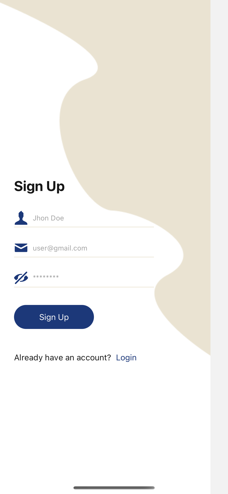
  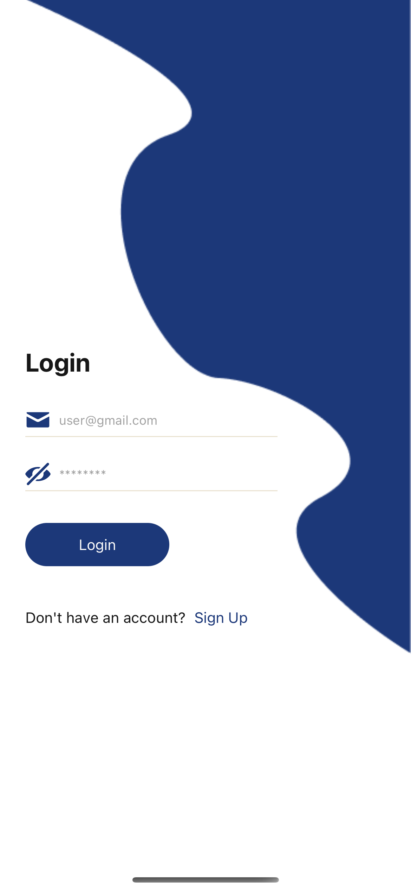

### 2. View Products
Show the list of products, single product details and review of a product.

  
  
  

### 3. Make Order

  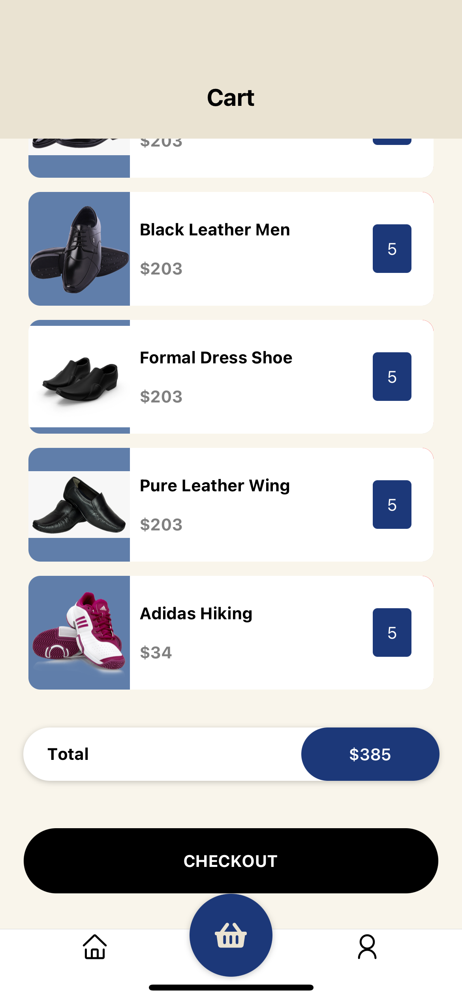
  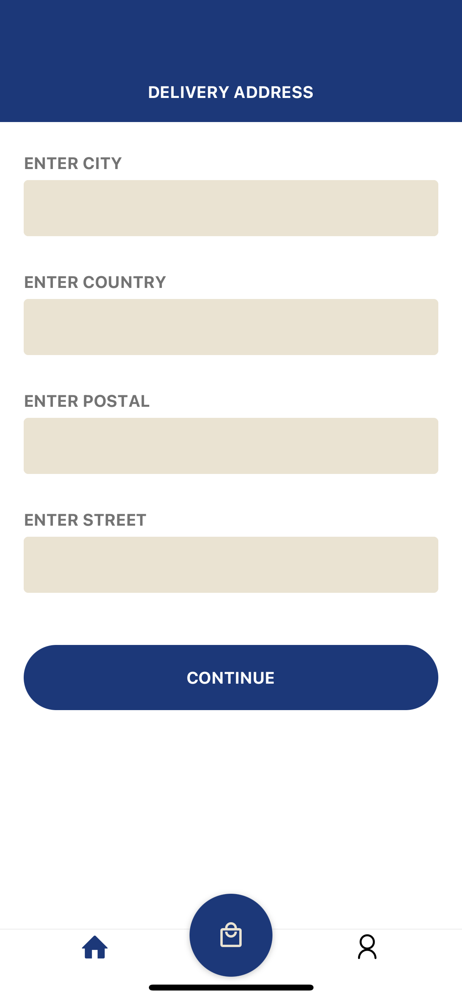
  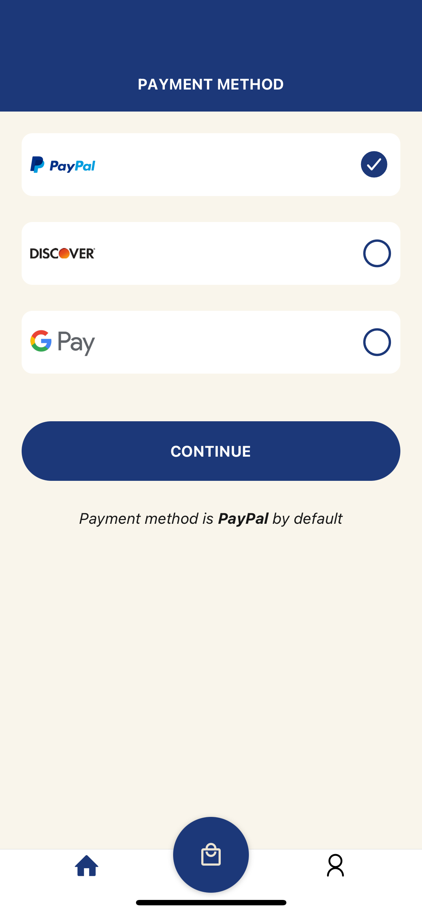
  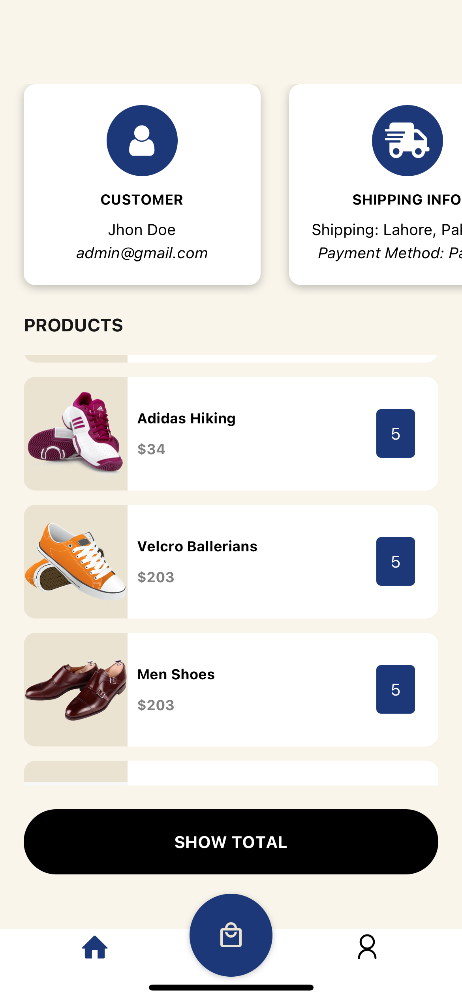
  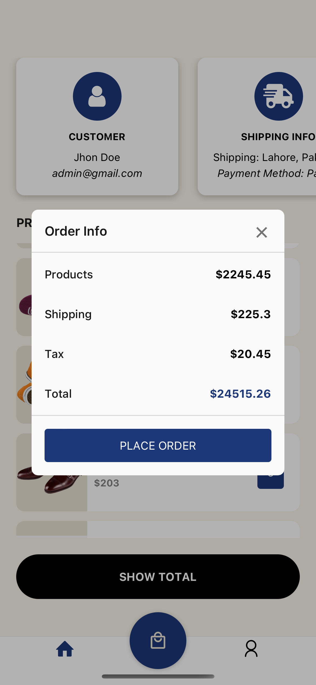
  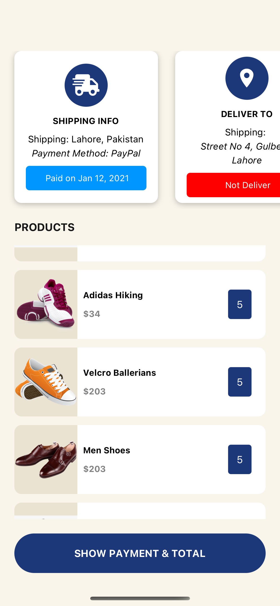
  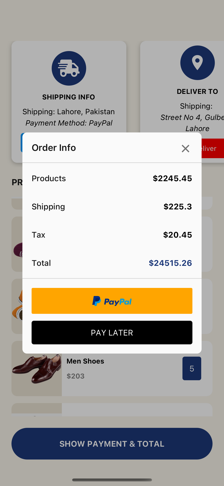
  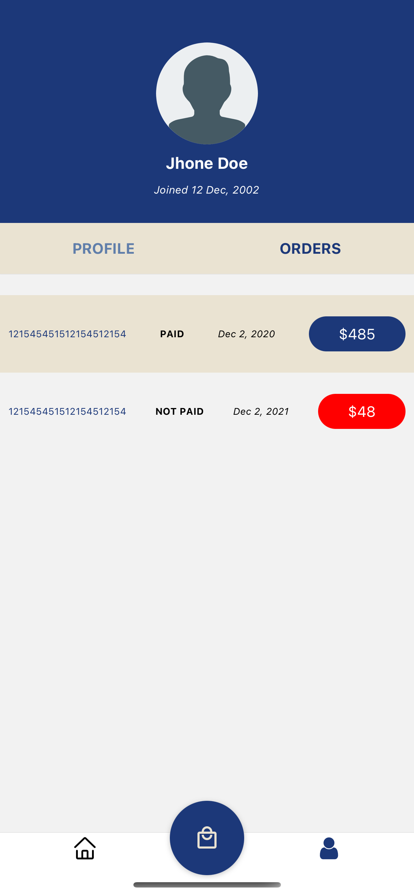

### 4. User Profile

  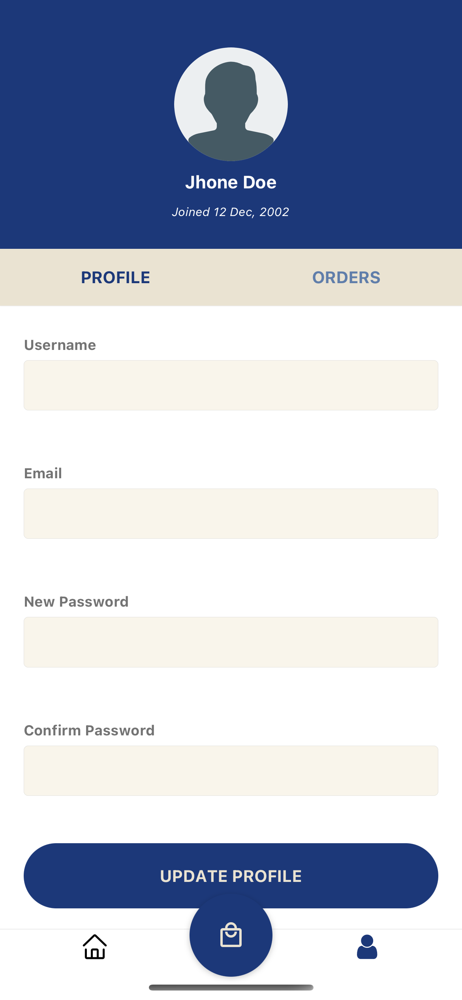

