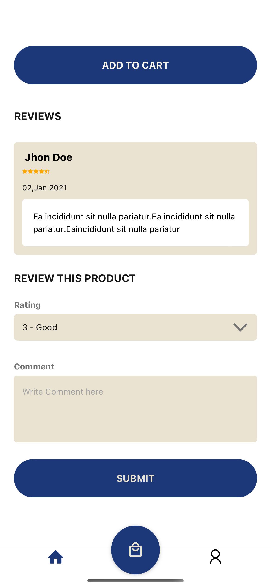

# EcommerceApp
This is react native e-commerce app. Only UI is completed in it.

## Modules Of UI

### Login/SignUp

  
  
  

### 1. View Products
The list of products are showing at this page. The custom product card component is being use in it.

  
  
  

